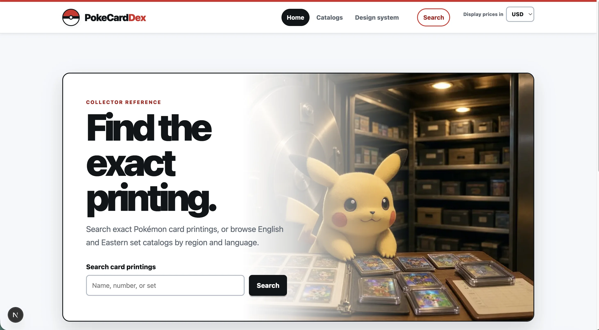

# PokeCardDex

PokeCardDex is a website for discovering Pokémon trading cards, exploring every released set, and checking the latest available market prices. It combines the familiar browsing experience of a Pokédex with practical tools for collectors.



## Vision

Create a fast, attractive, and easy-to-use reference where collectors can:

- Browse Pokémon card sets and their complete card lists.
- Search by card name, number, Pokémon, set, rarity, or type.
- View card artwork and important details.
- See current prices from one or more trusted marketplaces.
- Compare different printings and variants of a card.
- Follow how card prices change over time.

## Card information

Each card page could include:

- Card name and image
- Set name, set symbol, and release date
- Collector number and rarity
- Pokémon type, HP, attacks, abilities, and weaknesses
- Artist and relevant rules text
- Available variants, such as normal, reverse holo, and holofoil
- Latest market price, price source, currency, and last-updated time
- Historical price chart

## Set information

Each set page could include:

- Set name, logo, symbol, and release date
- Total number of cards
- Complete visual card checklist
- Completion progress for signed-in collectors
- Most valuable cards in the set
- Estimated cost or value of the full set

## Initial MVP

1. Display all available sets.
2. Browse every card within a selected set.
3. Search and filter cards.
4. Show a detailed page for each card.
5. Fetch and display the latest available prices.
6. Clearly show the price source and update time.
7. Provide a responsive experience on desktop and mobile.

## Possible future features

- Personal collection tracking
- Wishlist and missing-card checklist
- Collection value dashboard
- Price alerts
- Portfolio and price-history analytics
- Import and export of collection data
- Card scanning or image recognition
- User accounts and cloud synchronization
- Support for graded-card prices
- Support for additional trading card games

## Data considerations

PokeCardDex will need reliable sources for card metadata, images, set information, and current prices. The application should cache results, respect API usage limits and licensing terms, display when prices were last updated, and avoid presenting market estimates as guaranteed sale values.

## Working tagline

> Browse supported sets. Track exact card printings. See the latest available price quote.

## Development

PokeCardDex contains an English catalog backed by the Pokémon TCG API and Eastern set catalogs backed by TCGdex. The catalog chooser separates English from Eastern releases, then separates Eastern sets into Japanese, Korean, Simplified Chinese, and Traditional Chinese card databases. An opt-in RareBit proof of concept adds Japanese search and exact-card YuYuTei quotes denominated in JPY when configured.

Requirements:

- Node.js 20 or newer
- npm

Copy `.env.example` to `.env.local` and optionally add a Pokémon TCG API key. To enable the Japanese proof of concept, add a paid RareBit key with `catalog:read` and `prices:read` scopes as `RAREBIT_API_KEY`. Credentials are read only by server catalog adapters.

Catalog calls use a one-day application cache. TCGdex supplies language-specific Eastern set and card metadata without credentials. RareBit's broader `EAST` set directory is intentionally not used because it mixes Japanese, Korean, and Chinese releases. Confirm that the cache interval and intended price display are permitted by your RareBit plan before enabling RareBit outside development.

```bash
npm install
npm run dev
```

Open `http://localhost:3000/card-printings/base1-4` to view the tracer.

Verification commands:

```bash
npm test
npm run test:e2e
npm run typecheck
npm run verify:browser-safety
```

The Pokémon-inspired theme tokens, four reusable Poké Ball variants, and component states are demonstrated at `/design-system`. The shared header also lets collectors display available prices in USD, JPY, or EUR; conversions use informational European Central Bank reference rates while preserving every original Price Quote and its Price Source.

See the [Catalog MVP verification procedure](docs/verification/catalog-mvp.md) for browser checks and the current Japanese-provider blocker.
